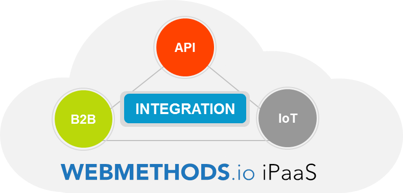
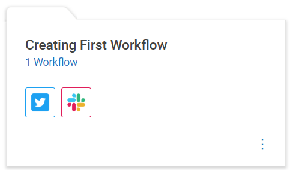
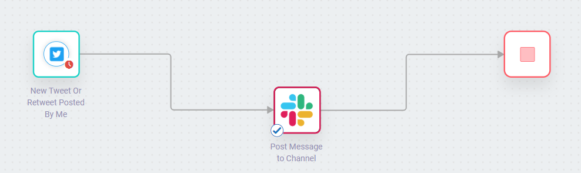

## 목차

   * [**webMethods.io란?**](#webmethods.io란?)
   * [**webMethods.io 서비스**](#webmethods.io-서비스)
     * [**webMethods.io B2B**](#webmethods.io-b2b)
     * [**webMethods.io API**](#webmethods.io-api)
     * [**webMethods.io Integration**](#webmethods.io-integration)

 

---

 

## webMethods.io란?

webMethods.io는 ESB, 데이터 통합 시스템, API 관리 도구 및 B2B 게이트웨이에서 제공하는 기능의 조합을 제공하는 서비스로서 강력한 통합 플랫폼(iPaaS)이다.

 

- 애플리케이션, 데이터, API, B2B 및 IoT 장치를 통합하여 여러 클라우드 인프라 플랫폼에서 사용할 수 있다.
- 비용 효율성, 속도, 보안 및 유연성이 좋아서 업그레이드, 유지 관리 또는 수정을 할 필요가 없다.
- SaaS 애플리케이션을 연결하고 비즈니스 프로세스를 보다 효율적으로 만드는것이 가능하다.

 

#### **webMethods.io의 장점**

- 사용하기 쉬운 인터페이스

​       워크플로를 설계, 조립 및 배포하기 위한 직관적인 드래그 앤 드롭 인터페이스를 제공한다.

 

- 다중 테넌트 아키텍처

​       많은 테넌트가 각각 고유한 프로덕션 환경이 있는 단일 개발 환경을 공유 할 수 있다.

 

- 애플리케이션 커넥터

​       Saleforce나 Marketo와 같은 SaaS 애플리케이션과 REST,SOAP 같은 업계 표준 프로토콜에 대한

​       기본 연결을 제공한다.

 

- 온프레미스 연결

​       사용중인 서버를 빠르게 연결하여 안정적이고 안전한 클라우드 - 온프레미스 통합을 생성할 수 있다.

 

---

 

## webmethods.io 서비스

 

### webMethods.io B2B

webMethods.io B2B는 B2B 문서 번역 및 전송 서비스로, 네트워크의 파트너와 비즈니스 문서를 교환하여 생산 정보를 전달할 수 있다.

비즈니스 문서 교환에 동의한다면 조직 그룹인 B2B(Business-to-Business) 네트워크를 형성할 수 있다. 참여 조직에는 전략적 파트너, 구매자, 공급 업체 및 마켓 플레이스가 포함될 수 있다. 이러한 참여 조직을 파트너라고 한다.

파트너가 일반적으로 교환하는 비즈니스 문서에는 구매 주문, 주문 상태, 구매 주문 확인서, 송장 및 기타 도메인별 문서가 포함된다. webMethods.io B2B를 사용하면 회사에서 다른 조직에 연결하여 B2B 네트워크를 형성할 수 있다.

 

- 안전한 전송, 전체 가시성

​        ASN (Advanced Shipping Notices), 송장, 구매 주문서, 배달 증명, 견적 등을 위한 안전한 전송 및 번역,

​        거래 네트워크에서 B2B 거래에 대한 완전한 End-to-end 가시성을 확보할 수 있다.

 

- 자동화 된 프로필 관리

​       공유 관리 인프라를 사용하여 거래 파트너를 관리하는 방법을 개선한다. 각 파트너에 대해 14,000 개가

​       넘는 문서 유형의 즉시 사용 가능한 저장소를 활용하고 인바운드 및 아웃 바운드 통신 채널을 정의 및

​       저장하고 문서 처리 및 라우팅 정보 등을 유지할 수 있다.

 

- 직접 통합, 실시간 교환

​        B2B 프로세스를 백엔드 시스템에 빠르게 연결하고 webMethods.io Integration을 통해 B2B 프로세스를

​        Orchestration한다. 이를 통해 거래 파트너와 실시간으로 작업하여 비용이 많이 드는 지연시간을 줄이고

​        비즈니스 수행 방식을 가속화 할 수 있다.

 

---

 

### webMethods.io API

webMethods.io API는 웹, 모바일 및 사물 인터넷 (IoT) 애플리케이션에서 사용할 수 있도록 API를 타사 개발자, 파트너 및 기타 소비자에게 안전하게 관리하고 노출시켜주는 서비스이다.

 

- 안전한 API 게이트웨이

​        API를 외부로 노출시킬때 중요시 해야할 점은 보안이다. 이 서비스를 사용하면 무단 및 악의적인 사용자로부터

​        보호할 수 있고 어떤 사용자가 API에 접근하는지에 대한 관리를 할수 있다.

 

- 협업을 위한 개발자 포털

​       개발자는 API를 검색, 테스트 및 등록 할 수 있다. 개발자 포털은 API 오퍼링의 공개적인 얼굴이며 생태계를 만들고

​       성장시킬 수 있다.

 

- API로 수익을 창출하는 방법

​       API는 직접 구독 수익 창출 또는 간접 수단을 통해 조직의 가치를 창출하도록 설계되었다. 가치 창출을 선택하더라도

​       API 계획 및 패키지 제품을 생성 할 수 있는 도구를 제공한다.

 

- API 개선을 위한 분석

​       사용량을 추적하고 통계 및 대시보드를 제공하여 API 서비스 계약을 충족시키고 API가 어떻게 액세스 및

​       사용되는지 확인한다.

 

---

 

### webMethods.io Integration

webMethods.io Integration은 Marketo,Salesforce 및 Gmail과 같은 앱과 서비스에 연결하여 작업을 자동화 할 수 있는 서비스로서 강력한 통합 플랫폼 (iPaaS)이다.

 

- 통합 및 혁신의 자유

​       클라우드 애플리케이션은 채택하기 쉽지만 통합하기가 어렵다. webMethods.io Integration을 사용하면

​       SaaS 애플리케이션을 연결하고 비즈니스 프로세스를 보다 효율적으로 만드는 것이 쉬워진다.

​       애플리케이션이 데이터를 교환하고 서로 원활하게 통신할 수 있으며, 통합을 구축하기 위해 값 비싼 개발자를

​       고용할 필요가 없다.

 

- 셀프 서비스 통합

​       유지 관리 및 업그레이드 프로젝트를 제거하여 TCO를 낮추고, 전문 지식을 필요치 않아 셀프 서비스 통합이 가능하다.

 

- 환경에 대한 더 나은 가시성

​        webMethods.io Integration은 모든 webMethods.io 시스템에 대한 전체 가시성을 제공한다. 오류가 있을 때 이를

​        실시간으로 경고하여 조치를 취하도록 하며 원인 분석을 통해 드릴-다운하여 문제가 있는 위치를 확인할 수 있다.

 

#### **webMethods.io Integration 기본 개념**

 

- Project란?

프로젝트는 자산을 구성하기 위한 폴더 또는 컨테이너에 해당한다. 테넌트 내부의 워크 플로 및 FlowService와 관련된 구성과 함께 사용자가 만든 모든 자산을 보유한다.

 

- Workflow란?

워크 플로는 둘 이상의 웹 애플리케이션 또는 서비스 간의 연결이다. 간단히 말해서 워크 플로를 만드는 것은 조건을 정의하는 것과 같다. '서비스 A'에서 이벤트가 발생하면 '서비스 B'에서 무언가를 수행하고 (선택적으로) '서비스 C', '서비스 D'에 데이터를 전달한다.

이렇게 트리거 및 작업을 정의하여 사용자 지정 워크 플로를 만들고 업무들을 자동화 할 수 있다.

 

※ Workflow 예시

Trigger : 자신의 트위터 계정에 새로운 트윗 또는 리트윗이 게시될 때

Action : 연결한 Slack 채널에 알림을 보낸다.

 

- FlowService란?

FlowService는 작업의 기본 단위이며, 풍부한 데이터 매핑 기능, 익숙한 디버깅 메커니즘 등 특정 요구 사항에 따라 작업을 자동화 할 수 있는 다양한 기능을 제공한다.

이전에는 App Switcher를 사용하여 Flow Editor로 전환하고 Flow Editor에서 필요한 통합을 생성한 다음 워크플로에서 이를 수행해야 했다. 현재 FlowService는 단일 서비스 내에서 일련의 서비스를 캡슐화 할 수 있고, 여러 애플리케이션 엔드포인트를 포함하는 복잡한 고급 통합 시나리오를 생성하고, 로컬에서 워크플로를 가져오거나 단일 서비스 내에서 워크플로를 관리할 수 있다.